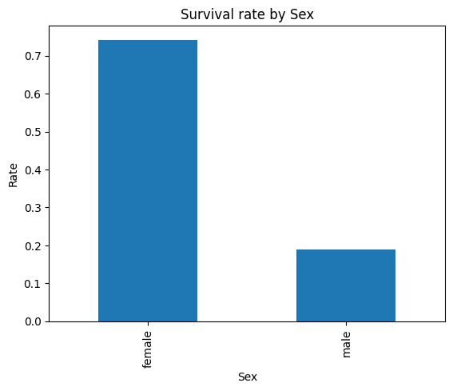
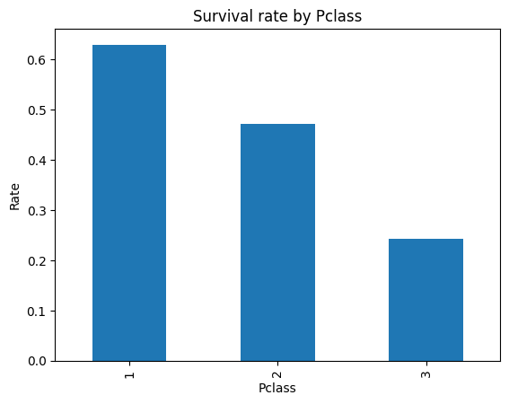

# ML - Titanic-Survival-Prediction
Classification Problem - Predict which passengers survived the Titanic disaster using the classic Titanic dataset.

---

### Problem Statement

Predict whether a passenger survived the Titanic disaster using demographic and travel information.
Dataset: [Kaggle – Titanic: Machine Learning from Disaster](https://www.kaggle.com/c/titanic)

---

### Exploratory Data Analysis

* **Survival rate by sex:** Females had a ~74% survival rate vs ~19% for males.
* **Survival rate by class:** 1st class passengers had the highest survival (~63%), 3rd class the lowest (~24%).

 

---

### Models Tried

* **Logistic Regression:** Baseline linear model, interpretable and well-suited for binary classification.
* **Decision Tree:** Explored non-linear relationships and feature importance.

Best performing model: **Logistic Regression** (`C=1.0`, `L2` penalty)

---

### Validation Metrics

| Metric    | Logistic Regression | Decision Tree |
| :-------- | :-----------------: | :-----------: |
| Accuracy  |        0.816        |     0.804     |
| Precision |        0.810        |     0.804     |
| Recall    |        0.681        |     0.652     |
| F1 Score  |      **0.740**      |     0.720     |
| ROC-AUC   |      **0.850**      |     0.823     |

---

**Result:** Logistic Regression achieved the best balance of precision, recall, and ROC-AUC, indicating strong generalization for this dataset.

